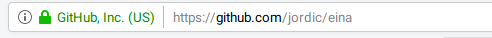

# Clase 1

## Capacitación Básica

- Quién sabe...
  - Que es un archivo?
  - Que es un directorio?
  - Que es un editor de textos?
  - Que es un servidor?
  - Que es un cliente?
  - Que es un ftp?

***

## De qué estan hechas las webs...

Archivos, html, css, scripts. (Demo)

```
Ejercicio
-
1. Crearemos una carpeta para almacenar los
   distintos ejercicios del curso

2. Crearemos un archivo llamado hola.txt,
   en el introduciremos el texto Hola Mundo
```


### Archivos y extensiones.

`nombre_de_archivo.txt`

**.txt** es la extensión (y normalmente denota el tipo (Content-type))
Hay muchos tipos de archivos:

```
.png/.jpg/.gif     -> Imágenes
.pdf               -> Documentos pdf
.doc, .otf         -> Documentos de texto
.avi, .mov, .divx  -> Vídeos
.css               -> Archivos css
.html              -> Documentos html
.js                -> Documentos Javascript
...
```
Tanto MAC como WINDOWS nos ocultan estas extensiones y nos muestran iconos que representan el tipo de archivo en su lugar. (Para poder trabajar en web, necesitamos mostrar las extensiones de los archivos)


Mostrar extensiones de archvios
- [MAC](https://www.todoappleblog.com/mostrar-extensiones-archivo-mac/)
- [Windows](https://helpx.adobe.com/es/x-productkb/global/show-hidden-files-folders-extensions.html)


## La estructura básica de un documento html

```html
<html>
  <head>
    <title>Hola</title>
    <meta name="keywords" description="value, value, value" />
  </head>
  <body>
    <h1>El contenido</h1>
    <p>Contenidoo</p>
  </body>
</html>
```

## 8bits y el unicode

1 byte = 000000 = 256 elementos


Donde estan las **ñ** o las **ç**

UTF-8: [Wikipedia](https://es.wikipedia.org/wiki/UTF-8)

Longitudes variables para poder usar muchos mas códigos, :relaxed:

La template html con utf-8

```html
<!doctype html>
<html lang="en">
<head>
  <meta charset="utf-8">

  <title>The HTML5 Herald</title>
  <meta name="description" content="The HTML5 Herald">
  <meta name="author" content="SitePoint">
</head>
<body>

</body>
</html>
```

## Doctype?
El html es una variante del xml. El [XML](https://es.wikipedia.org/wiki/Extensible_Markup_Language) es un lenguaje de etiquetas extensible para representar información estructurada.

El html es una variante de este, por eso lo marcamos al principio del documento.


## Las etiquetas html. "tags"


### Tags sin contenido

``````

### Tags básicos:


## Ejercicio

```
Crearemos un nuevo archivo con extensión .html, y la template básica 
utf-8 y le añadiremos los tags y elementos básicos para 
experimentar con su funcionamiento
```

1. Que pasa si al elemento `<p>` le añadimos un atributo style con las siguientes propiedades `background-color:red; color: white`

2. Nos descargaremos una imágen de internet, la copiaremos dentro de una carpeta de nuestra carpeta de proyectos (a la carpeta le diremos images), la renombraremos a imagen1.(la extensión que tenga). Usaremos esta imágen en un tag `` mediante el atributo `src=images/imagen1.png`


## Clientes y Servidores

### Como puedo hacer que todo el mundo vea mi pequeña creación en html?


- La descripción de la Wikipedia [Wiki](https://es.wikipedia.org/wiki/Cliente-servidor)


- Un cliente es un programa informático que se conecta con un servidor
- Un servidor es un programa informático que atiende a peticiones de sus clientes
- Para comunicarse el cliente con el servidor usan un protocolo (HTTP) para la web.
- Existen muchos otros protocolos.
  - FTP (File Transfer Protocol)
  - RMTP (Rich Media Transfer Protocol)
  - SMTP (Simple Mail Transfer Protocol)
  - SSH (Secure shell)
  - Telnet
  - POP3
  - IMAP
  .....

El servicio HTTP que usamos para visualizar webs con nuestro navegador, fundamentalmete, ofrecen un protocolo para descargar elementos de un servidor remote. (En la RED)

Cuando el navegador se conecta con un recurso, utiliza instrucciones del tipo `GET /imagenes/imagen1.png` para descargar recursos.

En lo esencial, un servidor web, atiende peticiones de sus clientes para servir documentos que tiene en su disco.

## El servicio FTP

File Trransfer Protocol

Este servicio nos permite subir archivos a un servidor remoto. Normalmente el servidor está configurado para darnos acceso a una carpeta en el servidor, donde hay un servidor web que nos permite recuperar estos archivos.

En nuestro caso, usaremos como cliente ftp el programa FileZilla
[Descargar](https://filezilla-project.org/download.php)


```
Ejercicio
--
- Crear la cuenta
- Configurar la cuenta de FTP de cada alumno.
- Crear una carpeta de nombre programacion y subir el ejercicio html realizado anteriormente en esta.
- Comprobar des del navegador accediendo a la dirección de nuestra carpeta:

```
La cuenta se puede crear en la [siguiente dirección](https://www.000webhost.com/)


## HTTPS

Secure HTTP.

- Hoy es el estandard.
- La comunicación entre el cliente y el servidor está **encriptada**, mediante el intercambio de secretos compartidos. De forma, que solo el cliente y el servidor pueden acceder a esta información. En nuestro navegador, lo podemos ver, porque en la barra de direcciones aparece un candado verde.




## Ejercicios, lecturas y recomendaciones.

Obligatório:
- [Tutorial Básico html W3CSchools](https://www.w3schools.com/html/)


Opcionales:
- [VideoTutorial Youtube](https://www.youtube.com/watch?v=hrZqiCUx6kg)
- [WebDesign in 4 minutes](https://jgthms.com/web-design-in-4-minutes/)
- [Marksheet Tutorial](https://marksheet.io/)
  - [Lección 1](https://marksheet.io/introduction.html)
  - [Lección 2](https://marksheet.io/html-basics.html)
