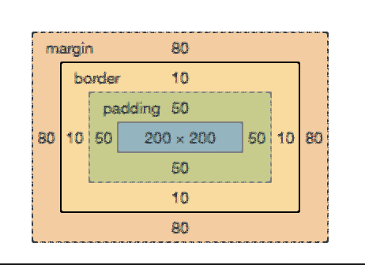

# Clase 4

## Repaso sesión anterior

- Estilos en linea vs hojas de estilo
- Selectores: .class, #id, elemento
- table/blockquote
- Propiedades css: [Referencia](https://tympanus.net/codrops/css_reference/)


## Bloques y medidas. (CSS Box Model)

- Los bloques son considerados cajas de las cuales podemos controlar
sus medidas y espaciados.

  - `width/height:` Ancho/Alto de la caja
  - `max-width/min-width`: Max i minimo width
  - `margin:` es el margen exterior a partir del border
  - `boder`: El borde de la caja
  - `padding`: Espacio interior de la caja

- Por defecto los margenes/paddings y borders se suman al ancho de la caja,
a no ser que usemos la propiedad `box-sizing: border-box`. Mucha gente, si obta
por este segundo modelo de caja, sobreescrive todos las popiedades:

```css
<style>
* {
    box-sizing: border-box;
}
</style>
```

<blockquote style="padding:20px;">
El atributo **box-sizing** es clave para poder construir layouts de forma
simple, sin tener que restar y sumar (margenes y paddings).
</blockquote>



- Las propiedades de medidas (padding/border/margin) se pueden declarar
para cada uno de los lados concretos, para todos o para uno en concreto.

```css
margin: 10px // 10px de margen a todo el elemento
padding: 10px 5px 10px 0px; // top / right / bottom / left
border-bottom: 1px solid black;

```

- Overflow: `auto,hidden,visible`: Al setear el tamaño de una caja de forma
absoluta (width y height) el contenido puede no caber en la caja, mediante esta
propiedad podemos ajustar, como este contenido se adatpará:

  - `overflow: hidden`: El contenido sobrante queda oculto.
  - `overlow: auto`: Si hay demasiado contenido, aparecen barras de scroll automáticamente
  - `overflow: visible`: El contenido sobrante es visible sobrepasando los límites de la caja.

- Y finalmente recordamos que tenemos tres tipos de cajas básicos:
   - **inline** se adapta al contenido, adaptandose al flujo de este
   - **block** una caja que se apila a las otras.
   - **inline-block** Sigue el flujo, pero admite propiedades de tamaño.

- [Artículo en MDN](https://developer.mozilla.org/en-US/docs/Learn/CSS/Introduction_to_CSS/Box_model)


```
Ejercicio
---
Emepzaremos con una caja <div> con contenido de texto lorem.
Le aplicaremos margen, padding, border. Seguidamente,
añadiremos la propiedad box-sizing, y comprobaremos con el inspector
como evoluciona.

Añadiremos una nueva caja con mucho contenido, y probaremos los distintos,
tipos de overflow disponibles.

```


## Flotado y posicionado de cajas.

### Que es un float?

La forma mas simple de entender un float, es mirando al diseño de papel,
la forma como las imágenes se pueden añadir dentro de un bloque de texo
y el texto pasa a fluir dentro.

```
Ejercicio
---
Creamos un bloque <p> con un exto largo y dentro añadiremos una imágen,
probamos de colocarle un atributo style="float:right" luego lo cambiamos
a float:left
```
- Esta misma técnica se puede usar con bloques, de tamaño fijo. Podemos probar
creando dos `<div>` con contenidos, que midan un 50% de la página y añadiendo
un `float:left` a ambos.
- Tradicionalmete los floats se han usado para construir layouts, aunque hoy
estan en desuso, aún son muy útiles para la construcción de versiones
responsive.


### Float

`float: left`
`float: right`

- Podemos "flotar" alinear bloques que no ocupen el 100% a derecha o izquierda,
usando la propiedad float.

- Tradicionalmente se ha usado para esto un contenedor `<div>` que hace de emboltorio
del contenido y dentro se han ubicado los elementos que queremos floar y/o posicionar.
Por ejemplo usando porcentajes en el interior y un tamaño fijo en el exterior.


### Limpiar los floats.

- Para limiar los floats, en una sucesión de elementos podemos usar un clear:both,
que reestablecerá el flujo del bloque.
- Hay un caso curioso, cuando dentro de un contenedor todos los elementos estan
floatdos, el navegador no es capaz de calcular el tamaño del float, hay varios
hacks para arreglar esto, pero lo mas simple es crear un div (sin nada) con un
`clear:both` esto fijará los estilos.


```
Ejercicio
---
- Crearemos un layout simple con un header, dos columnas centrales, que contengan
texto, y un footer.
- Evolucionaremos el layout añadiendo nuevos elementos de bloque dentro de las
columnas.

```


## Emboltorios y contenedores

Un embolotrio nos permite fijar sus elementos internos, es común usar un
emboltorio (p. e. `<main>`) para fijar un tamaño máximo de ancho con la propiedad
max-width:


Un wrapper que nos centra el contenido
```css
.wrapper {
  margin-right: auto; /* 1 */
  margin-left:  auto; /* 1 */

  max-width: 960px; /* 2 */

  padding-right: 10px; /* 3 */
  padding-left:  10px; /* 3 */
}
```
