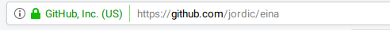

# Clase 6

## Capacitación Básica

- Quién sabe...
  - Que es un archivo?
  - Que es un directorio?
  - Que es un editor de textos?
  - Que es un servidor?
  - Que es un cliente?
  - Que es un ftp?

***

## De qué estan hechas las webs...

Archivos, html, css, scripts. (Demo)

```
Ejercicio
-
1. Crearemos una carpeta para almacenar los
   distintos ejercicios del curso

2. Crearemos un archivo llamado hola.txt,
   en el introduciremos el texto Hola Mundo
```


### Archivos y extensiones.

`nombre_de_archivo.txt`

**.txt** es la extensión (y normalmente denota el tipo (Content-type))
Hay muchos tipos de archivos:

```
.png/.jpg/.gif     -> Imágenes
.pdf               -> Documentos pdf
.doc, .otf         -> Documentos de texto
.avi, .mov, .divx  -> Vídeos
.css               -> Archivos css
.html              -> Documentos html
.js                -> Documentos Javascript
...
```
Tanto MAC como WINDOWS nos ocultan estas extensiones y nos muestran iconos que representan el tipo de archivo en su lugar. (Para poder trabajar en web, necesitamos mostrar las extensiones de los archivos)


Mostrar extensiones de archvios
- [MAC](https://www.todoappleblog.com/mostrar-extensiones-archivo-mac/)
- [Windows](https://helpx.adobe.com/es/x-productkb/global/show-hidden-files-folders-extensions.html)


## 8bits y el unicode

1 byte = 000000 = 256 elementos


Donde estan las **ñ** o las **ç**

UTF-8: [Wikipedia](https://es.wikipedia.org/wiki/UTF-8)

Longitudes variables para poder usar muchos mas códigos, :relaxed:

La template html con utf-8

```html
<!doctype html>
<html lang="en">
<head>
  <meta charset="utf-8">

  <title>The HTML5 Herald</title>
  <meta name="description" content="The HTML5 Herald">
  <meta name="author" content="SitePoint">
</head>
<body>

</body>
</html>
```


## Clientes y Servidores

### Como puedo hacer que todo el mundo vea mi pequeña creación en html?


- La descripción de la Wikipedia [Wiki](https://es.wikipedia.org/wiki/Cliente-servidor)


- Un cliente es un programa informático que se conecta con un servidor
- Un servidor es un programa informático que atiende a peticiones de sus clientes
- Para comunicarse el cliente con el servidor usan un protocolo (HTTP) para la web.
- Existen muchos otros protocolos.
  - FTP (File Transfer Protocol)
  - RMTP (Rich Media Transfer Protocol)
  - SMTP (Simple Mail Transfer Protocol)
  - SSH (Secure shell)
  - Telnet
  - POP3
  - IMAP
  .....

El servicio HTTP que usamos para visualizar webs con nuestro navegador, fundamentalmete, ofrecen un protocolo para descargar elementos de un servidor remote. (En la RED)

Cuando el navegador se conecta con un recurso, utiliza instrucciones del tipo `GET /imagenes/imagen1.png` para descargar recursos.

En lo esencial, un servidor web, atiende peticiones de sus clientes para servir documentos que tiene en su disco.

## El servicio FTP

File Trransfer Protocol

Este servicio nos permite subir archivos a un servidor remoto. Normalmente el servidor está configurado para darnos acceso a una carpeta en el servidor, donde hay un servidor web que nos permite recuperar estos archivos.

En nuestro caso, usaremos como cliente ftp el programa FileZilla
[Descargar](https://filezilla-project.org/download.php)


```
Ejercicio
--
- Crear la cuenta
- Configurar la cuenta de FTP de cada alumno.
- Crear una carpeta de nombre programacion y subir el ejercicio html realizado anteriormente en esta.
- Comprobar des del navegador accediendo a la dirección de nuestra carpeta:

```
La cuenta se puede crear en la [siguiente dirección](https://www.000webhost.com/)


## HTTPS

Secure HTTP.

- Hoy es el estandard.
- La comunicación entre el cliente y el servidor está **encriptada**, mediante el intercambio de secretos compartidos. De forma, que solo el cliente y el servidor pueden acceder a esta información. En nuestro navegador, lo podemos ver, porque en la barra de direcciones aparece un candado verde.




### Ejercicio


- Confeccionar vuestro curriculum vitae en html semántico, subirlo a vuestro servidor,
  en la ruta <nombrededominio.com>/cv.html


# Flexbox

- Un nuevo modelo de caja felxible y adaptativo.
- Solo soportado por navegadores modernos (98%). Hay casos extraños
con antiguas versiones de IE. [Can I use Flexbox](https://caniuse.com/#feat=flexbox)
- Se pueden resolver muchísimos problemas del modelo antiguo de cajas, con
las novedades de flexbox: Columnas de igual altura, grids sin porcentajes, cambio del orden de elementos en distintos dispositivos...


```
Ejercicio
----
Un grid sencillo: columna central con dos sidebars.
flex0.html
```

- Flexbox representa la primera herramienta para construir *layouts* en
30 años. (Lo que aprendimos en sesiones anteriores, son hacks feos, no
pensados para crear layouts).


### Básicos Flex

- El model flexbox implica un container: `display:flex` y una serie de items
dentro de este.

```html
<ul class="flexbox-container">
    <li>Flex item</li>
    <li>Flex item</li>
    <li>Flex item</li>
</ul>
```

- Podemos controlar el ancho de un item, asignandole un tamaño, al item con la propiedad `flex`: [Codepen](https://codepen.io/machal/pen/WPGrLP)

- Si a la propiedad `flex` de los items asignamos 1, repartimos el espacio de
forma igual. Si queremos ampliar una de las columnas a el doble, podemos asignar
2 o 3 para el triple. [Codepen](https://codepen.io/machal/pen/PRaVrR)

- El parámetro flex, puede tomar los siguientes valores: `auto|none|initial|1-10`

- Podemos asignar un width a un elemento, pero la gracia de flexbox es que tiene su propia semántica, lo haremos con `flex-basis`.


### Los ejes en flexbox.

- Flexbox puede utilizar dos formas de distribuir los elementos, una para el eje horizontal `flex-direction: row` y otra para el eje vertical `flex-direction:column`

- Con el atributo `row` distribuye los objetos en la misma fila, con el atributo `column` los distribuye en la columna. Si usamos el atributo `col-reverse` o `row-reverse` los ordena al revés.

- [Ver Ejemplo, flex-direction](https://codepen.io/jordic/pen/NJMOpQ)


### Margenes, espaciado (justify-content)

- En flexbox no es necesario fijar los márgenes, de hecho lo podemos realizar fijando el ancho de la columna. Por ejemplo:

```css
.item-flex {
    flex-basis: 20%;
}
```
Genera un elemento del 30% de tamaño.

- Podemos controlar la forma como se distribuyen los objetos utilizando la propiedad `justify-content`, que puede tomar los siguientes valores: `flex-start | flex-end | center | space-between | space-around`

- [Flexbox: justify-content](https://codepen.io/jordic/pen/RdyeQq?editors=1000#0)

- Si lo deseamos, también podemos aplicar márgenes a los elementos, aunque si lo que estamos construyendo son sistemas de columnas, no tiene demasiado sentido.

### Alineación en el eje contrario. (align-items)

- Podemos decidir la alineación de los elementos en el eje contrario del que estamos usando en flexbox. **Si**, usando la propiedad `align-items`, que pude tomar los siguientes valores:

```css
/* Basic keywords */
align-items: normal;
align-items: stretch;

/* Positional alignment */
/* align-items does not take left and right values */
align-items: center; /* Pack items around the center */
align-items: start; /* Pack items from the start */
align-items: end; /* Pack items from the end */
align-items: flex-start; /* Pack flex items from the start */
align-items: flex-end; /* Pack flex items from the end */
align-items: self-start;
align-items: self-end;

/* Baseline alignment */
align-items: baseline;
align-items: first baseline;
align-items: last baseline; /* Overflow alignment (for positional alignment only) */
align-items: safe center;
align-items: unsafe center;

/* Global values */
align-items: inherit;
align-items: initial;
align-items: unset;
```

- Para que esto funcione, los elementos deben de tener un
tamaño vertical.

- [flexbox align-items](https://codepen.io/jordic/pen/bZMmQN)


### Modificar el posicionado de uno de los flex items

- Podemos modificar el posicionado de los elementos flex a nuestro gusto utilizando las propiedades `align-self`.


### Anidación flexbox

- Podemos aplicar la propiedad `display:flex` a un item que a su turno forma parte de un container con `display:flex`. Así el clásico problema de alinear algo en el centro y a su vez su contenido también centrado, es fácil de resolver:

- [Centrado total de row y contenido](https://codepen.io/jordic/pen/KERrmv?editors=1000)


### Controlar el orden de los elementos

- Podemos forzar el orden de los elementos dentro de un container flex, con la propiedad `order: 1` en los items que deseemos ordenar.

- [Forzamos la ordenación](https://codepen.io/jordic/pen/KERrZy?editors=1000)


```
Ejercicio
-----
Remaquetaremos nuestro CV usando todo lo que hemos aprendido hasta ahora de flexbox y bloques.
```


## Flexbox links

- [Youtube Flexbox](https://www.youtube.com/watch?v=k32voqQhODc)
- [CSS Tricks: A guide to Flexbox](https://css-tricks.com/snippets/css/a-guide-to-flexbox/)
- [Solved By Flexbox](https://philipwalton.github.io/solved-by-flexbox/)
- [CSS Mine. Interesting links to Flexbox](https://www.cssmine.com/ebook/flexbox-links)
- [Flexbox Boxes Playground](http://the-echoplex.net/flexyboxes/)
- [Flexbox: Practical Examples](https://www.cssmine.com/ebook/flexbox-examples)
